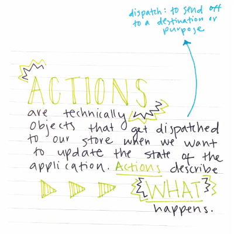
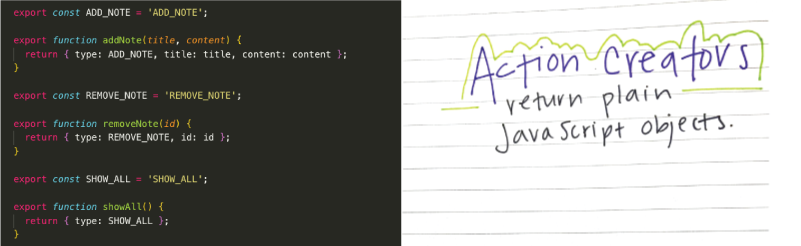
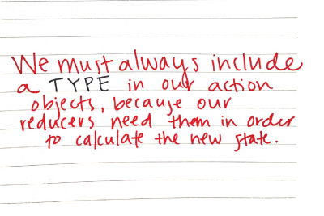
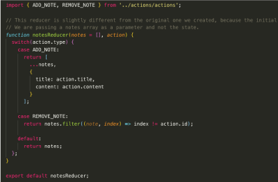
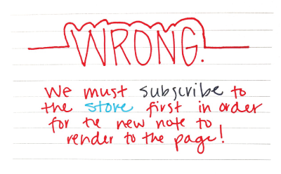

# Redux Notes App
I recently created this note-taking app in order to better understand Redux, and I wanted to add my own visual tutorial to further explain just exactly what is happening in the code. Check it out below, and I hope you find it useful.

### Ok so first thing’s first -- what even is Redux? 

#### Annnd what do we really need to know about Redux?

#### Redux is comprised of three parts:
* Actions
* Reducers
* Store

### 1. Actions

#### Ok cool, so actions get dispatched to the store and that’s it, right? Mmm, not quite.

### 2. Reducers

#### And what about this store? What is that, you ask?

### 3. Store

#### Alright now that we know the basics, let’s look at some code.

#### Our app is not using React as a frontend framework, so we have a simple index.html file in the root of our project and a JS file in the root of our src folder to help manipulate the changes to the DOM. I’ve circled the elements of the HTML that we will be referencing in our JS file for the add note action.

#### At the top of our JS file, we import the store and some functions we’ve created in the action.js file (more about this later).

#### We can use the store object in this file to do things like dispatch actions, get the state, and subscribe to the store. But let’s take a look at the actions before we continue on in this file.

#### Basically the action file exports constants and functions called “action creators.” 

#### In our note-taking app, this first addNote action creator accepts two parameters (title and content), and it returns an object with the information the user provides. 

#### Note that each function also returns a type, which is the constant we created. 

#### So let’s take a look at our reducers (remember that we have passed our actions to the reducers). In this app, we are using the combineReducers function that is provided from Redux. In this way, we can separate our reducers into different files according to the specific actions that are passed down to them. Let’s just take a look at the Notes Reducer for now.

#### We import the ADD_NOTE and REMOVE_NOTE variables at the top. And in the function, we return two different arrays depending on the action type that is defined (see, I told you we would need that type value).

#### In the case of adding a note, if the action type is equal to ADD_NOTE, then a notes array with the new title and content is returned. In other words, the user typed in a title and content (the action), and their input is returned here in the reducer. A new state has been returned, and it is saved in the store!

#### Here is the store: 

#### We have imported createStore from Redux as well as the reducers. Remember that multiple reducers (for notes and visibility) have been saved in one reducer file, and that is the one that’s imported here. We don’t need to create an initial state -- that’s optional. The only mandatory argument we need to pass here is the reducers. Now that the state is saved in the store, we can subscribe to it in order to update the UI. Let’s go back to our JS file.

#### There are quite a few things going on here, but let’s just take a look at the renderNotes function. 

#### As previously mentioned, we can access the store.getState function in order to retrieve the current state of notes. We can then map through all of the notes in the state, and return a variable for each one that consists of a title, notes content, and a number (index) that will help us know which note to delete if we should choose to do so. This variable called noteItem is added to the page using vanilla JavaScript, and voila, right?!

#### Ok now -- Voila! 

I hope you have found this little visual tutorial helpful if you are learning Redux. I will create a React-Redux specific tutorial in the future, so visit my GitHub page again soon for that.

The tutorial for this application can be found [here.](https://medium.com/javascript-in-plain-english/the-only-introduction-to-redux-and-react-redux-youll-ever-need-8ce5da9e53c6)

